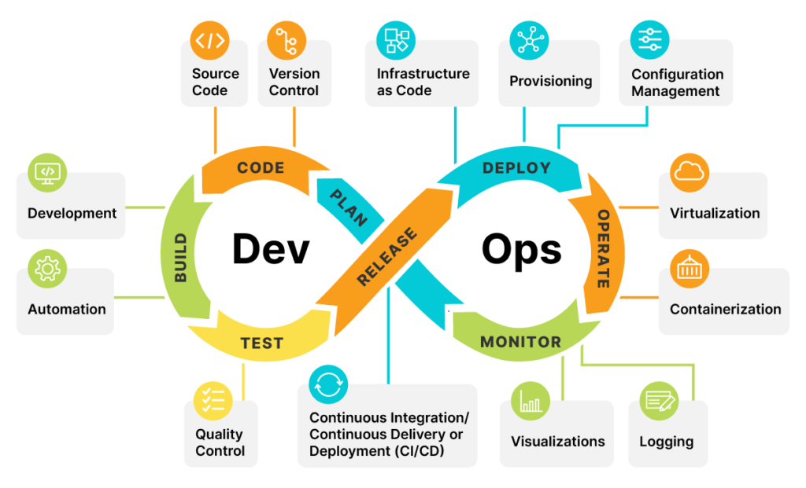

# DevOps Journey

## Welcome to the DevOps Journey! 🌟

This repository is designed to provide a comprehensive guide to DevOps practices, tools, and technologies. Whether you're a beginner or an experienced professional, you'll find valuable resources to enhance your skills and knowledge in the DevOps domain.

## Table of Contents 📚

- DevOps Overview
  - [What is DevOps?](#what-is-devops-)
  - [Why DevOps?](#why-devops-)
  - [Key Areas of DevOps](#key-areas-of-devops-)
- Cloud Computing
  - [What is Cloud Computing?](#what-is-cloud-computing-)
  - [Key Benefits of Cloud Computing](#key-benefits-of-cloud-computing-)
  - [Cloud Computing Service Models](#cloud-computing-service-models)
  - [Cloud Deployment Models](#cloud-deployment-models-)
  - [Leading Cloud Providers](#leading-cloud-providers-)
  - [Cloud Deployment & Hosting Platforms (Vercel)](#cloud-deployment--hosting-platforms-)

## What is DevOps? 🚀

DevOps is a set of practices that merge software development (Dev) and IT operations (Ops) to enhance collaboration, automate workflows, and improve the speed and reliability of software delivery. It focuses on continuous integration, continuous deployment (CI/CD), infrastructure as code (IaC), security, monitoring, and automation.

### Why DevOps? 🤔

DevOps aims to:

- Improve collaboration between development and operations teams.
- Automate repetitive tasks to increase efficiency.
- Enhance software reliability and reduce deployment failures.
- Enable faster releases with continuous delivery.

### Key Areas of DevOps 🔑

1. **CI/CD Pipelines**: Automates software building, testing, and deployment to ensure rapid and reliable releases.
2. **Infrastructure as Code (IaC)**: Manages infrastructure using code for consistency, scalability, and automation.
3. **Monitoring & Logging**: Helps track system performance and detect issues proactively.
4. **Security (DevSecOps)**: Integrates security practices into DevOps workflows to ensure secure applications and infrastructure.
5. **Cloud Providers ([AWS, Azure, GCP](#leading-cloud-providers-))**: Provide cloud-based infrastructure and services to enhance scalability and performance.

---

## 1. Cloud Computing ☁️

## What is Cloud Computing? 🚀

- Cloud Computing is the delivery of computing services such as servers, storage, databases, networking, software, and analytics over the internet (“the cloud”).
- It allows users to access and store data, run applications, and leverage IT resources on demand without owning physical infrastructure.
- Cloud computing offers scalability, flexibility, and cost efficiency, making it a key enabler for modern businesses and technologies.

### Key Benefits of Cloud Computing 🌍

- **Scalability**: Easily scale resources up or down as needed.
- **Cost Efficiency**: Pay only for the resources you use, reducing capital expenditure.
- **Flexibility**: Access computing resources from anywhere.
- **Security**: Cloud providers implement strong security measures to protect data.
- **Disaster Recovery**: Cloud-based backups ensure quick recovery from failures.

## Cloud Computing Service Models 🛠️

Cloud services are typically categorized into three main models:

1. **Infrastructure as a Service (IaaS)** 🏠

   - Provides virtualized computing resources over the internet.
   - Examples: Amazon EC2, Google Compute Engine, Microsoft Azure VMs (see [Leading Cloud Providers](#leading-cloud-providers-)).

2. **Platform as a Service (PaaS)** 🛠️

   - Offers a platform for developing, running, and managing applications.
   - Examples: Google App Engine, AWS Elastic Beanstalk, Azure App Services (see [Leading Cloud Providers](#leading-cloud-providers-)).

3. **Software as a Service (SaaS)** 🖥️

   - Delivers software applications over the internet on a subscription basis.
   - Examples: Google Workspace, Dropbox, Salesforce.

### Cloud Deployment Models 🌐

1. **Public Cloud** – Services are offered to multiple customers over the internet.
2. **Private Cloud** – Resources are dedicated to a single organization.
3. **Hybrid Cloud** – A combination of public and private cloud solutions.
4. **Multi-Cloud** – Utilizing multiple cloud providers for different services.

## Leading Cloud Providers 🔥

- **Amazon Web Services (AWS)**
  - The largest and most widely adopted cloud platform, offering a vast array of services.
  - Includes IaaS, PaaS, and SaaS solutions.
  - Popular services: EC2, S3, Lambda, RDS, and more.
  - [Learn more about AWS](https://aws.amazon.com/)
  - [Documentation](https://docs.aws.amazon.com/)
- **Microsoft Azure**
  - A comprehensive cloud platform with a wide range of services.
  - Supports various programming languages and frameworks.
  - Popular services: Azure VMs, Azure Functions, Azure SQL Database, and more.
  - [Learn more about Azure](https://azure.microsoft.com/)
  - [Documentation](https://docs.microsoft.com/en-us/azure/)
- **Google Cloud Platform (GCP)**
  - A suite of cloud computing services that runs on the same infrastructure as Google’s end-user products.
  - Offers IaaS, PaaS, and serverless computing.
  - Popular services: Google Compute Engine, Google Kubernetes Engine, BigQuery, and more.
  - [Learn more about GCP](https://cloud.google.com/)
  - [Documentation](https://cloud.google.com/docs)
- **IBM Cloud**
  - Offers a range of cloud computing services, including IaaS, PaaS, and SaaS.
  - Focuses on enterprise solutions and hybrid cloud deployments.
  - Popular services: IBM Cloud Kubernetes Service, IBM Cloud Functions, and more.
  - [Learn more about IBM Cloud](https://www.ibm.com/cloud)
  - [Documentation](https://cloud.ibm.com/docs)
- **Oracle Cloud**
  - Provides a comprehensive suite of cloud services, including IaaS, PaaS, and SaaS.
  - Focuses on enterprise applications and databases.
  - Popular services: Oracle Cloud Infrastructure, Oracle Autonomous Database, and more.
  - [Learn more about Oracle Cloud](https://www.oracle.com/cloud/)
  - [Documentation](https://docs.oracle.com/en/cloud/)

## Cloud Deployment & Hosting Platforms 🌍

### **Vercel** 🚀

Vercel is a cloud platform for deploying and hosting frontend applications, particularly those built with frameworks like Next.js, React, Vue, and Angular. It offers seamless integration with GitHub, GitLab, and Bitbucket, enabling automatic deployments with every code push.

#### **Key Features of Vercel:**

- **Serverless Deployment**: Deploys applications without managing infrastructure.
- **Automatic Scaling**: Scales applications based on traffic.
- **Edge Functions**: Runs server-side logic closer to users for faster response times.
- **Instant Rollbacks**: Easily revert to a previous deployment if needed.
- **Preview Deployments**: Provides unique URLs for testing before going live.

## Conclusion 🎯

Cloud computing has revolutionized the IT industry by offering scalable, cost-effective, and flexible computing solutions. Understanding cloud services and deployment models is crucial for modern DevOps practices.
